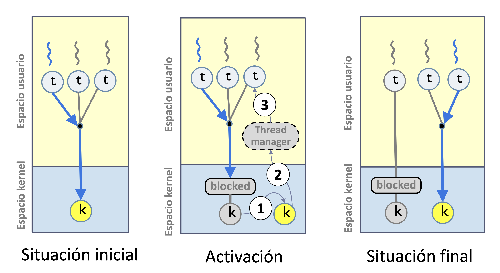

# Trabajo de Fin de Grado
##### Herramienta Didáctica para la Programación Concurrente

Autor: Adrián Fernández Galán
Tutor: Alejandro Calderón Mateos

---

# Motivación :rocket:
 

- **Sistemas Operativos**

---
 

#### Motivación :rocket:

- Desarrollo concurrente **frustrante**
- Conceptos **complicados**
- Ejecución de hilos **poco transparente**

---
# Objetivos :pushpin:
---
## Objetivos :pushpin:

Crear una herramienta que permita:
 

- **Desarrollar programas concurrentes**
- **Enfoque didáctico**
---

# Herramientas Similares a la Propuesta :mag:
---
#### Herramientas Similares a la Propuesta :mag:
- **GDB**
- **Clion**
- **Seer**
---

#### ¿Qué aporta la propuesta? :bulb:
- **Gratuita**
- **Fácil de usar**
- **Enfocada a la enseñanza**
- **Agnóstica** (no dependiente del sistema y máquina)

---
[Imagen comparativa]

---

### ¿Cómo se va a conseguir esto? :wrench:
- **Interfaz gráfica** fácil de usar
- **Visualización** del estado de los hilos
- **Controles** de la ejecución del programa
- **Abstracción** de los conceptos complejos
---
# Diseño
---
### Diseño