<!-- _header: "" -->
<!-- _footer: "" -->
<!-- _paginate: false -->

# Trabajo de Fin de Grado
##### Herramienta Didáctica para la Programación Concurrente

Autor: Adrián Fernández Galán
Tutor: Alejandro Calderón Mateos

    

---
###  Contenidos 

1. Introducción: Motivación y Objetivos
2. Estado del Arte
3. Planificación y Presupuesto
4. Diseño
5. Demo
6. Conclusiones y Trabajo Futuro

---
# 1. Introducción

---
<!-- _header: "1. Introducción" -->

# Motivación
 

- **Sistemas Operativos**

---
<!-- _header: "1. Introducción" -->

#### Motivación

- Desarrollo concurrente **frustrante**
- Conceptos **complicados**
- Ejecución de hilos **poco transparente**

---
<!-- _header: "1. Introducción" -->

## Objetivos

Crear una herramienta que permita:
 

- **Desarrollar programas concurrentes en C**
- **Enfoque didáctico**
---

# 2. Estado del Arte  
---
<!-- _header: "2. Estado del Arte" -->
#### Herramientas Similares a la Propuesta

    

        
GDB

        
    

    

        
CLion

        
    

    

        
Seer

        
    

---

<!-- _header: "2. Estado del Arte" -->
#### ¿Qué aporta la propuesta?
- **Gratuita**
- **Fácil de usar**
- **Enfocada a la enseñanza**
- **Agnóstica**

---
<!-- _header: "2. Estado del Arte" -->
### ¿Cómo se va a conseguir esto?
- **Interfaz gráfica** fácil de usar
- **Visualización** del estado de los hilos
- **Controles** de la ejecución del programa
- **Abstracción** de los conceptos complejos
---

# 3. Planificación y Presupuesto

---

<!-- _header: "3. Planificación y Presupuesto" -->

### Planificación

**Metodología en Cascada**
1. Planificación
2. Análisis
3. Diseño
4. Implementación
5. Evaluación
---
<!-- _header: "3. Planificación y Presupuesto" -->

---
<!-- _header: "3. Planificación y Presupuesto" -->
### Presupuesto del Proyecto

| Concepto | Coste |
|:----------|-------:|
| Personal | 10.650,00 € |
| Equipamiento | 113,30 € |
| Costes indirectos | 1.939,00 € |
| **Total** | **12.702,30 €** |

---
### Oferta
<!-- _header: "3. Planificación y Presupuesto" -->

| Concepto | Incremento | Coste Parcial | Coste Agregado |
|:----------|:-----------:|---------------:|----------------:|
| Coste del proyecto | 0% | 12.702,30 € | 12.702,30 € |
| Riesgo | 15% | 1.905,35 € | 14.607,65 € |
| Beneficio | 20% | 2.921,53 € | 17.529,18 € |
| Impuestos | 21% | 3.683,13 € | 21.212,31 € |
| **Total** | **56%** | **21.212,31 €** | **21.212,31 €** |

---
# 4. Diseño
---
##### Monolitico vs Distribuido
<!-- _header: "4. Diseño" -->

**Requisitos diferenciales**
- Herramienta **multiplataforma**
- Agnóstico a la **arquitectura** y al **SO**

    

        <h4>Monolítico</h4>
        
    

    

        <h4>Distribuido</h4>
        
    

---
<!-- _header: "4. Diseño" -->
##### Arquitectura Cliente-Servidor

**Requisitos diferenciales**
- Entorno controlado → Contenedores ***Docker***

    

        <h4 class="medium">Alternativa 1</h4>
        
    

    

        <h4 class="medium">Alternativa 2</h4>
        
    

---
<!-- _header: "4. Diseño" -->
##### Diseño Final

- **Contenedores**: *Python* + *Flask* + *WebSockets* + *GDB*
- **Proxy**: *Python*
- **Cliente**: *JavaScript* + *HTML* + *CSS*

---
# 5. Demo
---

# 6. Conclusiones y Trabajo Futuro
---

<!-- _header: "6. Conclusiones y Trabajo Futuro" -->
#### Conclusiones
- **Objetivos satisfechos**
    - Desarrollar programas concurrentes en C
    - Enfoque didáctico
- **Aprendizaje**
    - Arquitectura cliente-servidor
    - Arquitectura distribuida
    - *Dockerización* 
---

#### Trabajo Futuro
<!-- _header: "6. Conclusiones y Trabajo Futuro" -->

- **Mejora en la interfaz de usuario**
    - Diseño *responsive* y accesible
- **Aumento en las capacidades distribuidas**
    - DNS
    - Reinicio automático de contenedores
- **Nuevas funcionalidades de depuración**
    - Planificador de hilos personalizable
    - Soporte a más ficheros
    - Modificación de variables

---
# Gracias por su atención